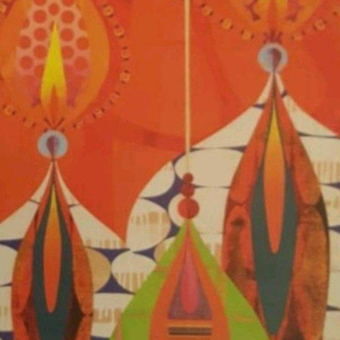
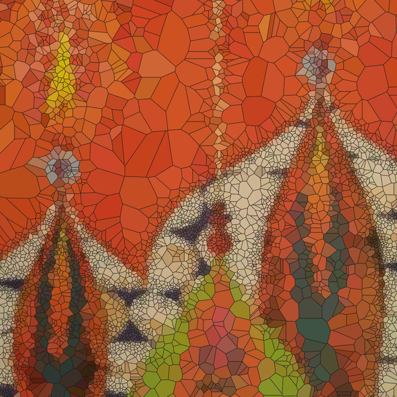

# Voronoi Art

Transform images into artistic Voronoi diagrams with adaptive sampling and bounded tessellation. Creates vector (SVG) and raster (PNG) outputs with interactive preview.

## Preview

| Input                      | Output                                    |
| -------------------------- | ----------------------------------------- |
|  |  |

_Example: Original image (left) transformed into adaptive Voronoi art (right)_

## How It Works

1. **Variance Analysis**: Calculates color variance across the image
2. **Adaptive Sampling**: Places more Voronoi sites in high-variance (detailed) regions
3. **Voronoi Tessellation**: Generates polygonal cells using scipy with boundary points to eliminate infinite regions
4. **Color Sampling**: Each cell takes the color from its center point
5. **Vector Export**: Saves as SVG
6. **Raster Rendering**: Converts to PNG at specified scale using CairoSVG

## Installation

### Using Poetry (Recommended)

```bash
# Clone the repository
git clone https://github.com/fritzip/voronoi-art.git
cd voronoi-art

# Install dependencies with Poetry
poetry install

# Run the tool
poetry run voronoi-art --input image.jpg
```

### System Installation

```bash
# Install globally to system with pipx (recommended for CLI tools)
pipx install .

# Now use from anywhere
voronoi-art --input ~/pictures/photo.jpg
```

## Usage

### Interactive Preview Mode (Recommended)

```bash
# Launch interactive preview with real-time parameter adjustment
voronoi-art --input photo.jpg --preview

# Interactive Controls in GUI:
#   - Points: Logarithmic slider (10 to 100,000 points)
#   - Strength: Exponential scale (0-10, fine control over adaptive sampling)
#   - Blur: Variance smoothness (1-20)
#   - Show Edges: Checkbox to toggle cell borders
#   - Edge Color: Color picker for border colors
#   - Edge Thickness: Integer slider (0-10 pixels)
#   - Scale: Output size multiplier (0.1x to 10x in 0.1 increments)
#   - Random Seed: Reproducible results (0-20)
# Click 'Save' to export with current settings
# Click 'Quit' to exit without saving
```

### Basic Usage

```bash
# Process an image with default settings
voronoi-art --input photo.jpg

# Output will be photo_voronoi.svg and photo_voronoi.png
```

### Advanced Options

```bash
# High detail with custom output and scaling
voronoi-art \
  --input landscape.jpg \
  --output artistic_landscape \
  --points 10000 \
  --strength 4.0 \
  --scale 2.0

# Low-poly style with visible edges
voronoi-art \
  --input portrait.png \
  --points 500 \
  --edge-color "#FF6B35" \
  --edge-thickness 2 \
  --blur 5

```

## Parameters

| Parameter          | Type   | Default           | Description                                                       |
| ------------------ | ------ | ----------------- | ----------------------------------------------------------------- |
| `--input`          | string | _required_        | Input image path (supports PNG, JPG, JPEG, BMP, TIFF, WebP, etc.) |
| `--output`         | string | `{input}_voronoi` | Output basename without extension                                 |
| `--preview`        | flag   | off               | Launch interactive preview with real-time adjustments             |
| `--debug`          | flag   | off               | Enable debug mode (shows debug controls and console output)       |
| `--points`         | int    | 6000              | Number of Voronoi sites (more = finer detail)                     |
| `--strength`       | float  | 3.0               | Adaptive sampling intensity (higher = more detail emphasis)       |
| `--blur`           | int    | 2                 | Variance map smoothness (lower = sharper transitions)             |
| `--scale`          | float  | 1.0               | Output size multiplier (2.0 = double resolution)                  |
| `--seed`           | int    | None              | Random seed for reproducible results (0-20)                       |
| `--edge-color`     | string | black             | Color of Voronoi edges (named colors or hex: 'red', '#FF0000')    |
| `--edge-thickness` | float  | 1                 | Thickness of Voronoi edges in pixels (0 = no edges)               |

## Requirements

- Python 3.8-3.13
- NumPy
- OpenCV (cv2)
- SciPy
- Dear PyGui (for interactive preview)
- svgwrite
- CairoSVG

## License

MIT License - feel free to use in your own projects!

## Contributing

Contributions welcome! Please open an issue or submit a pull request.
